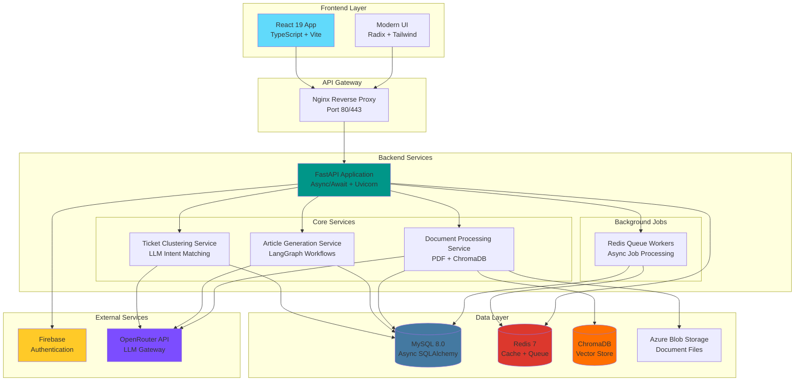
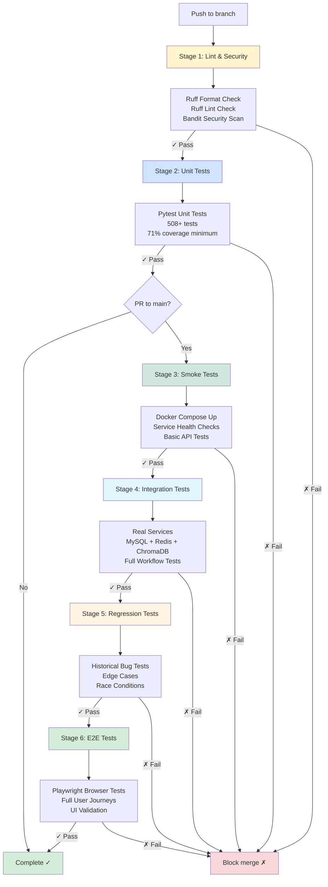
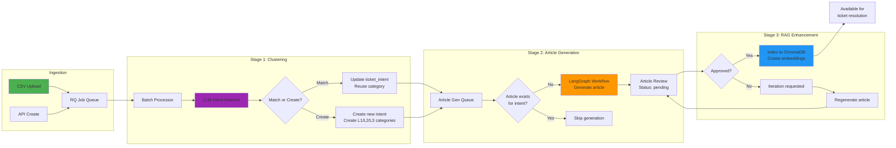
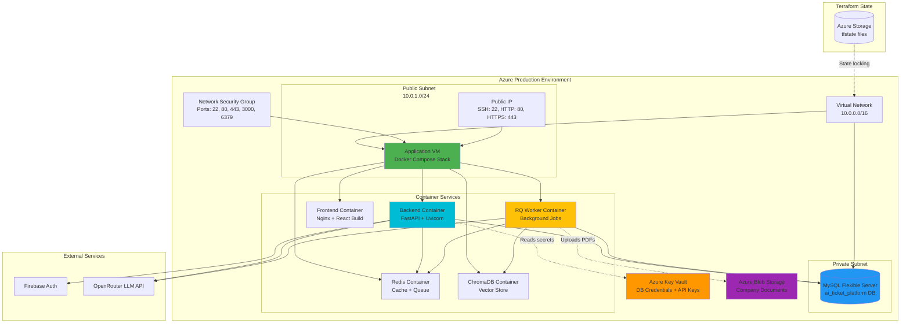

# AI-Powered Ticket Resolution Platform

A production-ready intelligent ticket resolution system built with FastAPI and React, featuring AI-powered clustering, automated content generation, and comprehensive CI/CD automation.

## Overview

This platform provides an AI-driven solution for automatically clustering, categorizing, and resolving customer support tickets using LLM-based intent matching, hierarchical categorization, automated knowledge base generation, and company document RAG (Retrieval Augmented Generation).

### Key Features

**Core Functionality**
- FastAPI backend with async/await patterns
- React 19 + TypeScript frontend
- AI-powered ticket clustering with LLM intent matching
- Hierarchical 3-level category taxonomy (L1/L2/L3)
- Automated article generation using LangGraph workflows
- Company document RAG with ChromaDB vector search
- Queue-based background processing with Redis Queue (RQ)
- Firebase authentication integration

**DevOps & Infrastructure**
- Complete CI/CD pipeline with 6-stage testing
- 71% test coverage with 508+ unit tests
- Infrastructure as Code with Terraform and Ansible
- Docker Compose orchestration
- Azure cloud deployment

### Architecture Diagrams

**System Architecture Overview**


**Continuous Integration Pipeline**


**Ticket Processing Workflow**


**Azure Production Architecture**


**Additional Architecture Resources**
- [Business Documentation](https://docs.google.com/document/d/1GDx8ERpdd2Bapt1hQfTBkYGhXiyvSLgq6holw6LnoTM/edit?usp=sharing)
- [Architecture Diagrams](https://drive.google.com/drive/folders/1_ayexeN45BHkkeS20wgo95ZOYBF-JX6T?usp=drive_link)

## See Extended Documentation
[CLAUDE.md](CLAUDE.md) - Comprehensive coding standards, architectural patterns, and development guidelines

---

## Prerequisites

- Python 3.8+ (Python 3.11 recommended)
- Docker and Docker Compose
- Node.js 18+ and npm
- Terraform (for infrastructure deployment)
- Ansible (for configuration management)
- AWS or Azure account (for production deployment)

---

## HOW TO RUN DEVELOPMENT

### Credentials

You need to setup environment variables for both frontend and backend folders.

#### Backend

Create file: `/backend/env_config/synced/.env.dev`

Include:

```bash
ENVIRONMENT="dev"
REDIS_URL="redis://redis:6379"
MYSQL_USER="root"
MYSQL_PASSWORD="rootpassword"
MYSQL_HOST="database"
MYSQL_PORT=3306
MYSQL_DATABASE="ai_ticket_platform"
MYSQL_SYNC_DRIVER="mysql+pymysql"
MYSQL_ASYNC_DRIVER="mysql+aiomysql"
SLACK_WEBHOOK_URL=
GF_SECURITY_ADMIN_PASSWORD=admin
CLOUD_PROVIDER='aws'
AWS_ACCESS_KEY_ID=
AWS_SECRET_ACCESS_KEY=
AWS_MAIN_REGION=us-east-1
## TERRAFORM OUTPUTS:
S3_MAIN_BUCKET_NAME=
GEMINI_API_KEY=
GEMINI_MODEL=gemini-2.5-flash
CHROMA_HOST=chromadb
CHROMA_PORT=8000
CHROMA_COLLECTION_NAME=company-docs
```

#### Frontend

Create file: `frontend/app/env_config/synced/.env.dev`

Include:

```bash
apiKey=
authDomain=
projectId=
storageBucket=p
messagingSenderId=
appId=
measurementId=
VITE_BASE_URL=http://localhost/api/
```

### Install Dependencies

Run from root:

```bash
make install
```

### Set Environment to Dev

Run from root:

```bash
export ENVIRONMENT=dev
```

### Run Dev

Run from root:

```bash
make dev-start
```

**Access services:**
- Frontend: http://localhost:3000
- Backend API: http://localhost/api
- Backend Docs: http://localhost/api/docs

**Stop development environment:**

```bash
make dev-stop
```

---

## HOW TO RUN PRODUCTION

### Credentials

You need admin-level credentials.

For that you need to set up your AWS access key ID or AWS secret key (you need to create them). You can use environment variables or write them locally in your computer (best practice). For the latter, see the following code snippet:

```bash
~/.aws/credentials
```

**File contents:**

```ini
[default]
aws_access_key_id = ""
aws_secret_access_key = ""
```

### Set the Proper Environment Variables

```bash
export ENVIRONMENT="production"  # or "staging"
export CLOUD_PROVIDER="aws"      # or "azure"
export BACKEND_VERSION="v0.0.1"  # for example: v0.0.1
```

### Go to `./infra`

```bash
cd infra
```

### Run Remote State Initialization

Run `make start-remote-state`, copy the S3 bucket name of the remote state.

```bash
make start-remote-state
```

### Configure Backend for Remote State

Go into `./infra/terraform{CLOUD_PROVIDER}/environment/{ENVIRONMENT}/main.tf` and change the backend configuration to reflect the remote state S3 bucket name captured in the prior step.

```hcl
terraform {
  required_providers {
    aws = {
      source  = "hashicorp/aws"
      version = "~> 5.0"
    }
  }

  backend "s3" {
    bucket  = "ai-ticket-platform-remote-state-bucket-zxmluk37" # Change
    key     = "remote-state/dev/terraform.tfstate"               # Keep
    region  = "us-east-1"                                         # Change if needed
    encrypt = true                                                # Keep
  }
}
```

### Run Install

```bash
make install
```

### Configure Terraform Variables

Go to `./infra/terraform{CLOUD_PROVIDER}/environment/{ENVIRONMENT}/terraform.tfvars` and write:

```hcl
environment   = "production"
main_region   = "us-east-1"
db_username   = "root"
project_name  = "ai_ticket_platform"
```

### Deploy to Production

Go back to the root and run either:

```bash
make deploy-start-artifacts  # Deploy to production (process: build artifacts + ansible)
make deploy-start-ansible    # Deploy to production (process: ansible)
make deploy-start-infra      # Deploy to production (process: infra + build artifacts + ansible)
make deploy-stop-infra       # Stop development environment
```

---

## Running Tests

### Backend Tests

```bash
cd backend

# Start test infrastructure (MySQL, Redis, ChromaDB with test configs)
make test-start

# Run specific test categories
make unit-test          # Unit tests only (71% coverage target)
make integration-test   # Integration tests with real services
make regression-test    # Regression tests for historical bugs
make smoke-test         # Smoke tests for health checks
make load-tests         # Load tests with k6

# Stop test infrastructure
make test-stop
```

### Frontend Tests

```bash
cd frontend/app

# Run linting
npm run lint

# Run format check
npm run format:check

# Fix formatting
npm run format
```

### End-to-End Tests

```bash
cd backend
make e2e-test  # Runs Playwright browser automation tests
```

---

## Tech Stack

### Backend
- Python (>=3.8), FastAPI, Uvicorn, Gunicorn
- Pydantic, SQLAlchemy (async ORM), MySQL 8.0, Alembic
- Redis 7 (caching + queue), RQ (background jobs)
- Firebase Admin, LangChain, LangGraph, ChromaDB, PDFPlumber
- Azure SDK (Blob Storage, Key Vault), Boto3 (AWS SDK)
- Prometheus FastAPI Instrumentator

### Frontend
- React (19.1.1), TypeScript (~5.8.3), Vite (7.1.2)
- React Router DOM (7.8.2), Tailwind CSS (4.1.12)
- Firebase (12.2.0), Radix UI, Lucide React
- React Hot Toast, React Markdown

### Infrastructure & DevOps
- Docker & Docker Compose, Nginx
- Terraform, Ansible, Azure

### Testing Tools
- Pytest, Pytest-asyncio, Playwright, k6
- ESLint, Prettier, Ruff, Bandit, Pre-commit

### AI Services
- OpenRouter (LLM API gateway)
- Google Gemini (via LangChain)
- ChromaDB (vector embeddings)

---

## References

- [Business Documentation](https://docs.google.com/document/d/1GDx8ERpdd2Bapt1hQfTBkYGhXiyvSLgq6holw6LnoTM/edit?usp=sharing)
- [Architecture Diagrams](https://drive.google.com/drive/folders/1_ayexeN45BHkkeS20wgo95ZOYBF-JX6T?usp=drive_link)
- [Coding Standards](CLAUDE.md)
- [PR Approval Guidelines](PRAPPROVAL.md)

---

## License

MIT License
